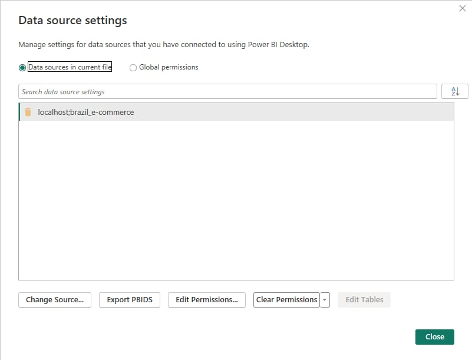

# 📊 Phân tích dữ liệu E-commerce Brazil (Power BI)

Đây là một dự án **phân tích dữ liệu end-to-end** sử dụng dataset thương mại điện tử Brazil (Olist).
Mục tiêu của dự án là phân tích **hiệu suất bán hàng, hành vi khách hàng, hiệu quả sản phẩm và seller** để tìm ra các insight có giá trị cho doanh nghiệp.

Dự án mô phỏng **quy trình làm việc thực tế của một Data Analyst**, từ lưu trữ dữ liệu, tiền xử lý dữ liệu cho đến xây dựng dashboard phân tích.

---

# 🚀 Điểm nổi bật của dự án

Khác với nhiều dashboard Power BI thông thường chỉ import dữ liệu và vẽ biểu đồ, dự án này xây dựng **một pipeline phân tích dữ liệu hoàn chỉnh**.

Các điểm nổi bật:

✔ Lưu trữ dữ liệu trong cơ sở dữ liệu PostgreSQL
✔ Tiền xử lý dữ liệu bằng SQL trước khi đưa vào Power BI
✔ Thiết kế mô hình dữ liệu theo **Star Schema**
✔ Xây dựng hệ thống **KPI bằng DAX**
✔ Dashboard phân tích nhiều trang phục vụ insight kinh doanh
✔ **Quản lý toàn bộ measure trong một bảng riêng (Measure Table)** để tối ưu mô hình

---

# 📂 Dataset

Dataset sử dụng: **Olist Brazilian E-commerce Dataset**

Bộ dữ liệu bao gồm thông tin về:

* Orders
* Customers
* Sellers
* Products
* Payments
* Reviews
* Geolocation

Dataset có:

* ~100,000 đơn hàng
* ~96,000 khách hàng
* nhiều seller và product category

Điều này giúp mô phỏng một **marketplace thực tế**.

---

# 🔌 Nguồn dữ liệu & Kết nối

Thay vì import trực tiếp file CSV vào Power BI, dữ liệu được:

1️⃣ Lưu trữ trong **PostgreSQL database**

2️⃣ Tiền xử lý bằng **SQL**

3️⃣ Sau đó Power BI kết nối trực tiếp vào database

Thông tin kết nối:

Host: localhost
Database: brazil_e_commerce

Cách tiếp cận này giúp:

* dữ liệu được quản lý tốt hơn
* dễ mở rộng
* mô phỏng kiến trúc data thực tế trong doanh nghiệp

---

# 🧹 Tiền xử lý dữ liệu bằng PostgreSQL

Trước khi đưa dữ liệu vào Power BI, dữ liệu được xử lý bằng SQL trong PostgreSQL.

Các bước tiền xử lý bao gồm:

• Loại bỏ dữ liệu trùng lặp
• Xử lý giá trị thiếu (missing values)
• Chuẩn hóa format ngày tháng
• Tổ chức lại các bảng dữ liệu quan hệ
• Chuẩn bị khóa chính và khóa ngoại

Việc tiền xử lý ở tầng database giúp:

* dữ liệu sạch hơn
* Power BI chạy nhanh hơn
* dễ quản lý pipeline dữ liệu

---

# 🏗 Kiến trúc dữ liệu

Pipeline của dự án:

Raw Dataset
↓
PostgreSQL Database
↓
Data Cleaning bằng SQL
↓
Data Modeling trong Power BI
↓
Dashboard phân tích

---

# 🧠 Data Modeling (Star Schema)

Thay vì dùng trực tiếp các bảng raw, dữ liệu được thiết kế lại theo **Star Schema**.

Mô hình này giúp:

* tối ưu hiệu suất query
* dễ mở rộng phân tích
* phù hợp cho BI dashboard

## Fact Tables

* fact_order_items
* fact_payments
* fact_reviews

## Dimension Tables

* dim_products
* dim_seller
* dim_customer
* dim_order
* dim_date
* dim_locations

## Data Model

---

# 📈 Hệ thống KPI (DAX)

Các KPI quan trọng được xây dựng bằng **DAX**:

* Total Revenue
* Total Orders
* Total Customers
* Average Order Value
* Average Review Score
* Orders per Customer
* Revenue per Seller
* Average Delivery Time

Những KPI này giúp đánh giá:

* hiệu suất marketplace
* hành vi mua hàng
* chất lượng dịch vụ

---

# ⭐ Điểm độc đáo: Measure Table

Một điểm đặc biệt của dự án là **tạo riêng một bảng Measure để quản lý toàn bộ KPI**.

Thay vì tạo measure rải rác trong các bảng dữ liệu, toàn bộ measure được đặt trong một bảng riêng có tên:

measure

Các measure được **phân nhóm theo folder** để dễ quản lý:

## Overview

* Total Revenue
* Total Orders
* Total Customers
* Average Order Value
* Average Review Score

## Customer Insights

* Active Customers
* Customer Total Spend
* Orders per Customer
* Total Items Sold

## Product

* Total Product Categories

## Seller Performance

* Total Sellers
* Seller Orders
* Revenue per Seller
* Orders per Seller
* Average Seller Rating
* Average Delivery Time

Cách tổ chức này giúp:

✔ mô hình dữ liệu sạch hơn
✔ dễ quản lý KPI khi dự án lớn
✔ dashboard dễ bảo trì và mở rộng

Đây là **best practice thường được sử dụng trong các dự án BI chuyên nghiệp**.

---

# 📊 Dashboard

Dashboard được thiết kế thành **4 trang phân tích chính**.

---

# 1️⃣ Overview Dashboard

Trang này cung cấp cái nhìn tổng quan về marketplace:

* Total Revenue
* Total Orders
* Total Customers
* Average Order Value
* Average Review Score

---

# 2️⃣ Customer Insights

Phân tích hành vi khách hàng:

* phân bố khách hàng theo khu vực
* giá trị chi tiêu
* số đơn hàng trung bình

---

# 3️⃣ Product Performance

Phân tích hiệu suất sản phẩm:

* top category theo doanh thu
* phân bố sản phẩm
* mối quan hệ giữa giá và doanh thu

---

# 4️⃣ Seller Performance

Phân tích seller:

* doanh thu theo seller
* số đơn hàng
* chất lượng dịch vụ
* thời gian giao hàng

---

# 🔍 Insight quan trọng

Một số insight rút ra từ dữ liệu:

• Doanh thu tập trung vào một số seller lớn
• Một số category sản phẩm chiếm phần lớn doanh thu
• Khách hàng tập trung ở một số bang lớn của Brazil
• Thời gian giao hàng có thể ảnh hưởng đến đánh giá của khách hàng

---

# 🛠 Công nghệ sử dụng

Dự án sử dụng các công nghệ:

* PostgreSQL
* SQL
* Power BI
* DAX
* Data Modeling
* Data Visualization

---

# 💡 Kỹ năng thể hiện trong dự án

Dự án thể hiện các kỹ năng của một Data Analyst:

* Database management
* Data preprocessing bằng SQL
* Data modeling (Star Schema)
* Xây dựng KPI
* Data visualization
* Business insight

---

# 👨‍💻 Author

Portfolio Project – Data Analysis
