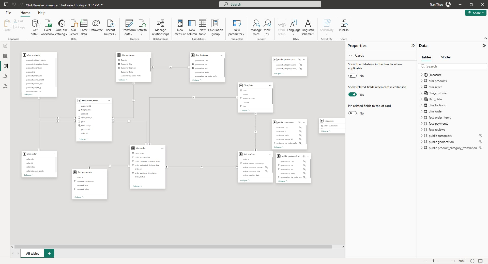
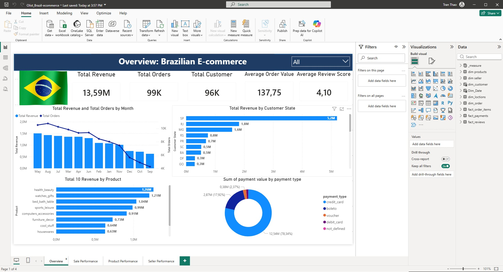
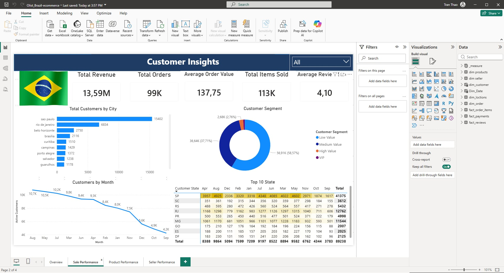
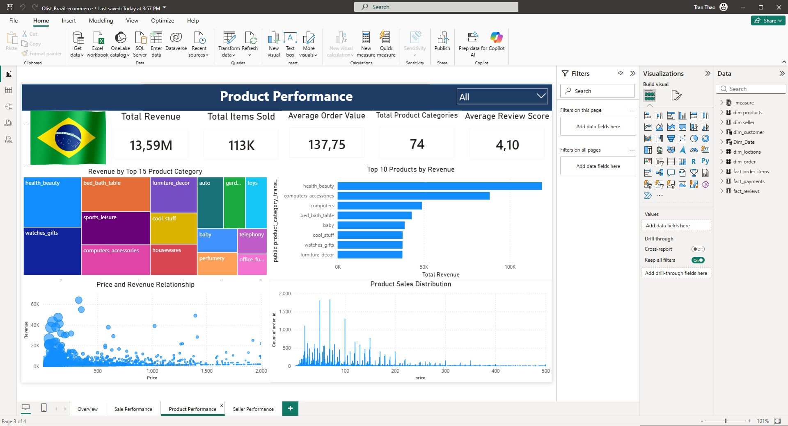
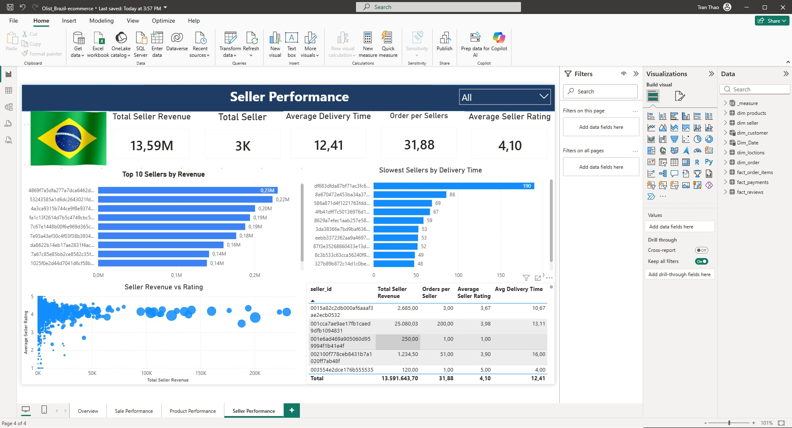

# 📊 Brazilian E-commerce Data Analysis (Power BI)

An end-to-end data analysis project built using Power BI on the Brazilian Olist E-commerce dataset.

The objective of this project is to analyze **sales performance, customer behavior, product trends, and seller efficiency** to uncover actionable business insights.

This project demonstrates the **full data analysis workflow**, from data modeling to dashboard storytelling.

---

# 🚀 Project Highlights

Unlike many typical Power BI dashboards that simply visualize imported data, this project focuses on:

✔ Designing a **Star Schema data model** for scalable analytics  
✔ Creating **business-oriented KPIs using DAX**  
✔ Performing **multi-dimensional analysis** across customers, products, sellers, and geography  
✔ Delivering insights through a **structured analytical dashboard**

---

# 📂 Dataset

Dataset used:

Olist Brazilian E-commerce Dataset

The dataset includes information about:

- Orders
- Customers
- Sellers
- Products
- Payments
- Reviews
- Geolocation

It contains more than **100k orders and nearly 100k customers**, enabling comprehensive analysis of an e-commerce ecosystem.

---

# 🧠 Data Modeling

Instead of directly visualizing raw tables, the dataset was redesigned into a **Star Schema model**.

This approach improves:

- query performance
- scalability
- analytical clarity

### Fact Tables

- fact_order_items
- fact_payments
- fact_reviews

### Dimension Tables

- dim_products
- dim_sellers
- dim_customers
- dim_orders
- dim_date
- dim_locations

## Data Model

This model allows flexible analysis across **time, geography, product categories, and seller performance**.

---

# 📈 Key Business Metrics (DAX)

Several analytical measures were implemented using DAX.

Examples include:

### Total Revenue

SUM of all payment values across orders.

### Total Orders

Number of unique orders placed on the platform.

### Total Customers

Distinct customers who made purchases.

### Average Order Value (AOV)

Revenue per order.

### Average Review Score

Average customer satisfaction rating across all orders.

These metrics allow monitoring of **overall marketplace performance and customer experience**.

---

# 📊 Dashboard Structure

The Power BI dashboard contains **four analytical pages**.

---

# 1️⃣ Overview Dashboard

This page provides a high-level overview of the marketplace.

Key indicators include:

- Total Revenue
- Total Orders
- Total Customers
- Average Order Value
- Average Review Score

Key insights:

- The platform generated approximately **13.6M in total revenue**
- Nearly **100k orders** were processed
- Customer satisfaction remains relatively high with an average review score of **4.1**

---

# 2️⃣ Customer Insights

This page explores **customer behavior and distribution**.

Analysis includes:

- Customer distribution by location
- Customer segmentation based on order value
- Monthly customer growth

Insights discovered:

- A large portion of customers are concentrated in **major Brazilian states**
- Most customers belong to the **low to medium value segments**
- Customer growth shows fluctuations across months

---

# 3️⃣ Product Performance

This section analyzes **product category performance**.

Key analysis:

- Top product categories by revenue
- Distribution of product sales
- Price vs revenue relationship

Insights:

- Categories such as **Health & Beauty** and **Watches & Gifts** generate the highest revenue
- Product sales are heavily concentrated in certain categories
- Higher price does not always translate to higher sales volume

---

# 4️⃣ Seller Performance

This page focuses on **seller contribution and operational performance**.

Key analysis:

- Top sellers by revenue
- Seller delivery performance
- Revenue concentration among sellers

Insights:

- A small number of sellers contribute disproportionately to total revenue
- Seller efficiency varies significantly across the platform
- Delivery performance plays a role in customer satisfaction

---

# 🔍 Key Analytical Findings

From the analysis, several patterns emerge:

• Marketplace revenue is concentrated among **a limited number of sellers**  
• Certain product categories dominate overall sales performance  
• Customer distribution is highly **geographically concentrated**  
• Operational performance such as delivery time can influence review scores  

These findings can support **strategic decisions for marketplace growth and seller management**.

---

# 🛠 Tools & Technologies

Tools used in this project:

- Power BI
- DAX
- Data Modeling
- Data Visualization

---

# 💡 Skills Demonstrated

This project demonstrates key data analyst skills:

- Data modeling using star schema
- Business KPI design
- Data visualization
- Analytical storytelling
- Insight generation

---

# 👨‍💻 Author

nguyenkien100604
